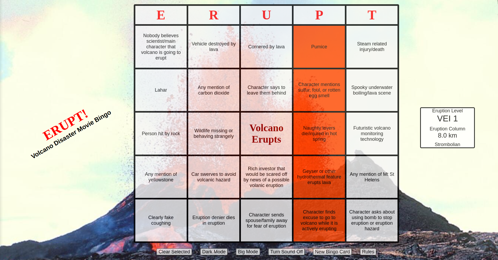
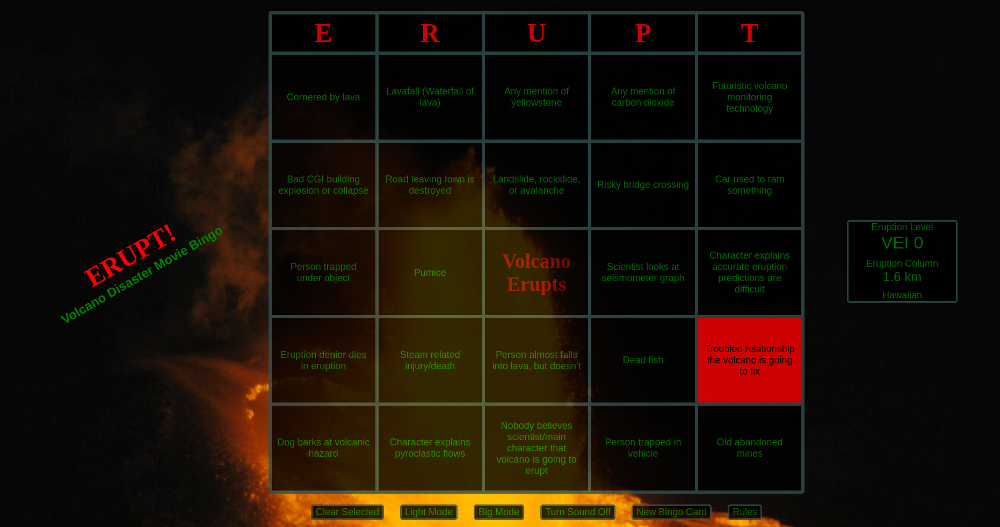
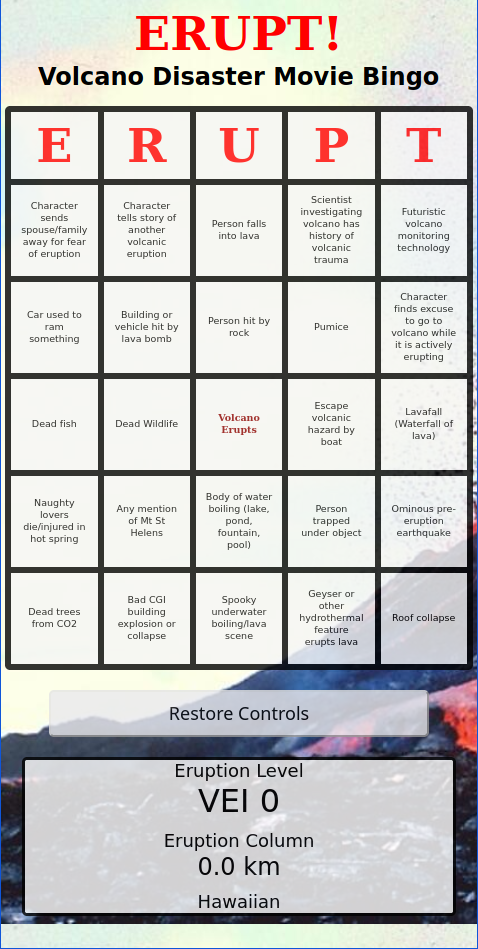

# Erupt: Volcano Movie Bingo
Bingo, for volcano disaster movies..

## Screenshots

The search and add movies screen.

The results screen.  

## Installation

If you'd like to run or customize your own Volcano Bingo server.

### Prereqs
- A current version of NodeJS installed
- NPM installed
- For docker installations: Docker and Docker Compose

### Installing with docker compose (Recommended):
1. Clone the repository.
    > git clone https://git-site/this-repository
2. Open the folder in terminal, and install npm packages
    > npm i
3. Adjust the docker-compose.yml file as needed.
4. Run docker compose in the root folder of your copied repository.
    > docker compose up -d
5. Access the web app in your web browser. (http://localhost:PORT/)

### Installing without containerization:
1. Clone the repository.
    > git clone https://git-site/this-repository
2. Open the folder in terminal, and install npm packages
    > npm i
3. Run node to start the server in the root folder of your copied repository.
    > node ./index.js
4. Access the web app in your web browser. (http://localhost:3500/)

## Configuration Options
- Edit the tropes.txt file to add/remove tropes that appear on cards.

## Tropes
There are two trope lists within the repository.
- tropes.txt - default tropes file, and only file read by the server for inclusion of tropes on bingo cards. This list has been curated to the most common volcano tropes, and is designed to maxmize the number of eruptions across all volcano movies.
- all-tropes.txt - This is a full list of common volcano movie tropes, including all in tropes.txt. Many common tropes in volcano movies are not present in all volcano movies. Adding all of these tropes to the bingo card generator is fun, but may result in lower average VEI scores/eruption column heights across movies.

### Suggesting Tropes
Feel free to suggest additional tropes to add to the master repository. However, only tropes that are present in at least 3 volcano movies will be considered for inclusion to the all-tropes.txt list. 

New tropes to the the tropes.txt are genreally not considered unless they're in most/all of these core volcano movies:
- Dante's Peak (1997)
- Volcano (1997)
- Volcano: Fire on the Mountain (1997)
- Supervolcano (2003)
- When Time Ran Out (1980)
- Skyfire (2021)
- Eruption (2009)
- Super Eruption (2011)

## Works used to create this site

### Volcano movies used in for bingo audio
Here is a list of the origin of all of the audio clips used to signal and eruption on the bingo card. Many more volcano movies were watched for building the full trope lists. I treasure all of these and strongly encourage you to find and watch them too:
- Terror Peak (2003)
- Dantes Peak (1997)
- Supervolcano (2003)
- Supereruption (2011)
- Volcano: Fire on the The Mountain (1997)

#### Fair Use
Please note that the audio clips are fair use of copyrighted material. When reusing material from his respository, your usage of any of the movie audio clips must also meet the criteria for fair use. You can determine if your use case is fair use by refering to the [Fair Use Index](https://www.copyright.gov/fair-use/index.html) created by the US Copyright Office. In the case of volcano bingo:

* Volcano bingo is non-commercial, and is specifically for the purposes of commenting on volcano movies.
* The material included serves an educational purpose that would otherwise not be as salient without: Identifying shared commonalities and plot points between different volcano films.
* The total amount of material used from each movie is small.
* Usage of the material does not replace or hurt the market for the original volcano movies; if anything, it encourages more people to watch them.

### Additional Content Used:
- The included background images are both public domain images sourced from the [USGS website](https://usgs.gov).
- This website would also not be possible without all of the awesome work done by the NodeJS, Express, and EJS teams.